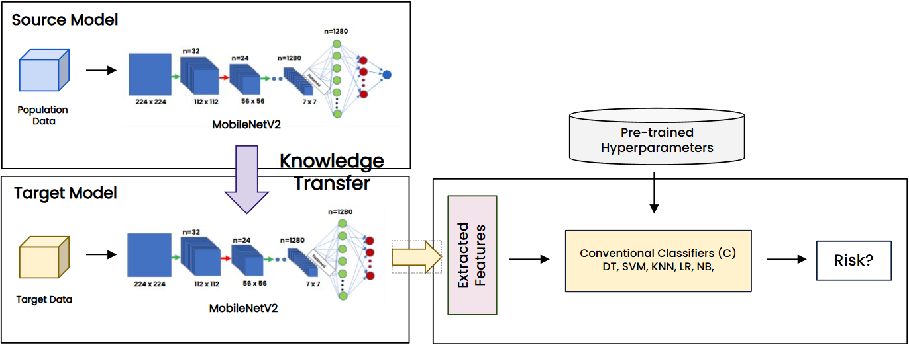
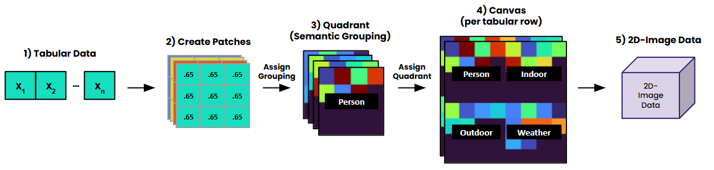

# <p align="center">QHETI: Quadrant-based Heterogeneous Tabular Imaging</p>

<div align="center">
 <a href="https://github.com/sahn1998/Research_Works">
    
  </a>

  <h3 align="center">A Quadrant-Based Imaging - Deep Learning Framework for Transfer Learning across Heterogeneous Tabular Datasets using CNN & Feature Extraction to Predict Health Risk in Asthma Patients</h3>
  
  <p align="center">
    Seattle University: AI/ML Research
    <br />
    <br />
    <a href="https://github.com/sahn1998">Sunghyun Ahn</a>
    <br />
    <a href="https://github.com/baew-seattleu">Wan Bae</a>
    <br />
    <br />
  </p>
</div>

## 1. QHETI Framework
<p align="center">
  
</p>
<p align="center"><b>Figure 1:</b> Transfer learning (TL) with CNN as a feature extractor and classical machine learning classifiers.</p>

<p align="center">
  
</p>
<p align="center"><b>Figure 2:</b> Tabular to 2D image conversion pipeline.</p>


## 2. Approach
A key distinction is made between retraining and fine-tuning:

1. **Source Modeling:** The base MobileNetV2 model (pretrained on ImageNet) is **retrained** using QHETI images derived from all patient data. This step captures general patterns associated with asthma risk.

2. **Individual Modeling:** The source models are then **fine-tuned** on each individual’s patient data. This personalization step aims to improve prediction accuracy for each patient.

3. **Feature Extraction & Evaluation:** Fine-tuned individual models are converted into **feature extractors** by removing their final classification layers. Patient data is processed to generate penultimate layer outputs, which are then used as features for classical machine learning models: Logistic Regression, Decision Trees, K-NN, Naive Bayes, and SVM. This ensemble approach leverages multiple algorithms to enhance predictive performance.


## 3. Dataset & Feature Overview

### Original Patient Dataset (30 Features)
```python
quadrant_features = {
    "Q1": [],  # Personal
    "Q2": [],  # Indoor
    "Q3": [],  # Outdoor
    "Q4": []  # Weather
  }
```

### New Patient Dataset (26 features)
```python
quadrant_features = {
    "Q1": [],  # Personal
    "Q2": [],  # Indoor
    "Q3": [],  # Outdoor
    "Q4": []  # Weather
}
```

## 4. Contributing

Contributions to this project are welcome. If you encounter any issues or have suggestions for improvements, please open an issue or submit a pull request.